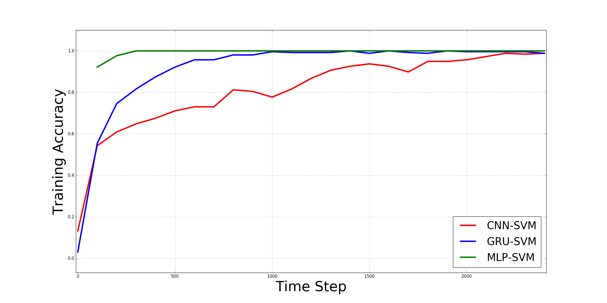

Towards Building an Intelligent Anti-Malware System: A Deep Learning Approach using Support Vector Machine for Malware Classification
===


[](https://zenodo.org/badge/latestdoi/112217643)
[]()
[]()

The full paper may be read at [arXiv.org](https://arxiv.org/abs/1801.00318).

## Abstract
Effective and efficient mitigation of malware is a long-time endeavor in the information security community.
The development of an anti-malware system that can counteract previously-unknown malware is a prolific activity that
may benefit several sectors. We envision an intelligent anti-malware system that utilizes the power of deep learning
(DL) models. Using such models would enable the detection of newly-released malware through mathematical generalization.
That is, finding the relationship between a given malware *x* and its corresponding malware family *y*, *f : x → y*.
To accomplish this feat, we used the Malimg dataset[[12](http://old.vision.ece.ucsb.edu/spam/malimg.shtml)] which
consists of malware images that were processed from malware binaries, and then we trained the following DL models 1 to
classify each malware family: CNN-SVM[[16](https://arxiv.org/abs/1306.0239)],
GRU-SVM[[3](http://arxiv.org/abs/1709.03082)], and MLP-SVM. Empirical evidence has shown that the GRU-SVM stands out
among the DL models with a predictive accuracy of ≈84.92%. This stands to reason for the mentioned model had the
relatively most sophisticated architecture design among the presented models. The exploration of an even more optimal
DL-SVM model is the next stage towards the engineering of an intelligent anti-malware system.

## Dataset

To use the dataset from this repository, you can intall [`pt-datasets`](https://github.com/afagarap/pt-datasets),

```shell script
$ pip install pt-datasets==0.2.0
```

## Usage
First, clone the project.
```bash
git clone https://github.com/AFAgarap/malware-classification.git/
```

Run the `setup.sh` to ensure that the pre-requisite libraries are installed in the environment.
```bash
$ sudo chmod +x setup.sh
$ ./setup.sh
```

Run the `main.py` with the following parameters.
```bash
usage: main.py [-h] -m MODEL -d DATASET -n NUM_EPOCHS -c PENALTY_PARAMETER -k
               CHECKPOINT_PATH -l LOG_PATH -r RESULT_PATH

Deep Learning Using Support Vector Machine for Malware Classification

optional arguments:
  -h, --help            show this help message and exit

Arguments:
  -m MODEL, --model MODEL
                        [1] CNN-SVM, [2] GRU-SVM, [3] MLP-SVM
  -d DATASET, --dataset DATASET
                        the dataset to be used
  -n NUM_EPOCHS, --num_epochs NUM_EPOCHS
                        number of epochs
  -c PENALTY_PARAMETER, --penalty_parameter PENALTY_PARAMETER
                        the SVM C penalty parameter
  -k CHECKPOINT_PATH, --checkpoint_path CHECKPOINT_PATH
                        path where to save the trained model
  -l LOG_PATH, --log_path LOG_PATH
                        path where to save the TensorBoard logs
  -r RESULT_PATH, --result_path RESULT_PATH
                        path where to save actual and predicted labels array
```

For instance, use the CNN-SVM model.
```bash
$ cd malware-classification
$ python3 main.py --model 1 --dataset ./dataset/malimg.npz --num_epochs 100 --penalty_parameter 10 --checkpoint_path ./checkpoint/ --log_path ./logs/ --result_path ./results/
```

To run a trained model, run the `classifier.py` with the following parameters.
```bash
usage: classifier.py [-h] -m MODEL -t MODEL_PATH -d DATASET

Deep Learning Using Support Vector Machine for Malware Classification

optional arguments:
  -h, --help            show this help message and exit

Arguments:
  -m MODEL, --model MODEL
                        [1] CNN-SVM, [2] GRU-SVM, [3] MLP-SVM
  -t MODEL_PATH, --model_path MODEL_PATH
                        path where to save the trained model
  -d DATASET, --dataset DATASET
                        the dataset to be classified
```

For instance, use a trained CNN-SVM model.
```bash
$ python3 classifier.py --model 1 --model_path ./trained-cnn-svm/ --dataset/malimg.npz
Loaded trained model from trained-cnn-svm/CNN-SVM-2400
Predictions : [ 1. -1. -1. ..., -1. -1.  1.]
Accuracies : [ 0.99609375  0.94140625  0.94921875  0.984375    0.95703125  0.9296875
  0.9296875   0.9609375   0.9296875   0.94921875  0.953125    0.92578125
  0.89453125  0.8203125   0.8125      0.75390625  0.8203125   0.84375
  0.8515625   0.94140625  0.7421875   0.94140625  0.984375    0.9921875   1.
  0.99609375  0.9765625   0.9609375   0.81640625  0.98828125  0.7890625
  0.8828125   0.94921875  0.96875     1.          1.        ]
Average accuracy : 0.9203559027777778
```

## Results
The experiments were conducted on a laptop computer with Intel Core(TM) i5-6300HQ CPU @ 2.30GHz x 4, 16GB of DDR3 RAM, and NVIDIA GeForce GTX 960M 4GB DDR5 GPU. Table 1 shows the hyperparameters used in the study.

**Table 1. Hyperparameters used in the DL-SVM models.**

|Hyperparameters|CNN-SVM|GRU-SVM|MLP-SVM|
|---------------|-------|-------|-------|
|Batch Size|256|256|256
|Cell Size|N/A|[256, 256, 256, 256, 256]|[512, 256, 128]|
|No. of Hidden Layers|2|5|3|
|Dropout Rate|0.85|0.85|None|
|Epochs|100|100|100|
|Learning Rate|1e-3|1e-3|1e-3|
|SVM C|10|10|0.5|

<br>



**Figure 1. Plotted using [matplotlib](http://matplotlib.org/). Training accuracy of the DL-SVM models on malware classification using the [Malimg dataset](http://old.vision.ece.ucsb.edu/spam/malimg.shtml).**

Figure 1 summarizes the training accuracy of the DL-SVM models for 100 epochs (equivalent to 2500 steps, since 6400 ×
100 ÷ 256 = 2500). First, the CNN-SVM model accomplished its training in 3 minutes and 41 seconds with an average
training accuracy of 80.96875%. Meanwhile, the GRU-SVM model accomplished its training in 11 minutes and 32 seconds
with an average training accuracy of 90.9375%. Lastly, the MLP-SVM model accomplished its training in 12 seconds with
an average training accuracy of 99.5768229%.

**Table 2. Summary of experiment results on the DL-SVM models.**

|Variables|CNN-SVM|GRU-SVM|MLP-SVM|
|---------|-------|-------|-------|
|Accuracy|77.2265625%|84.921875%|80.46875%|
|Data points|256000|256000|256000|
|Epochs|100|100|100|
|F1|0.79|0.85|0.81|
|Precision|0.84|0.85|0.83|
|Recall|0.77|0.85|0.80|

Table 2 summarizes the experiment results on the DL-SVM models on malware classification using the
[Malimg dataset](http://old.vision.ece.ucsb.edu/spam/malimg.shtml).

## Citation

To cite the paper, kindly use the following BibTex entry:
```
@article{agarap2017towards,
  title={Towards building an intelligent anti-malware system: a deep learning approach using support vector machine (SVM) for malware classification},
  author={Agarap, Abien Fred},
  journal={arXiv preprint arXiv:1801.00318},
  year={2017}
}
```

To cite the repository/software, kindly use the following BibTex entry:
```
@misc{abien_fred_agarap_2017_1134207,
  author       = {Abien Fred Agarap},
  title        = {AFAgarap/malware-classification v0.1-alpha},
  month        = dec,
  year         = 2017,
  doi          = {10.5281/zenodo.1134207},
  url          = {https://doi.org/10.5281/zenodo.1134207}
}
```

## License
```
Copyright 2017 Abien Fred Agarap

Licensed under the Apache License, Version 2.0 (the "License");
you may not use this file except in compliance with the License.
You may obtain a copy of the License at

   http://www.apache.org/licenses/LICENSE-2.0

Unless required by applicable law or agreed to in writing, software
distributed under the License is distributed on an "AS IS" BASIS,
WITHOUT WARRANTIES OR CONDITIONS OF ANY KIND, either express or implied.
See the License for the specific language governing permissions and
limitations under the License.
```
